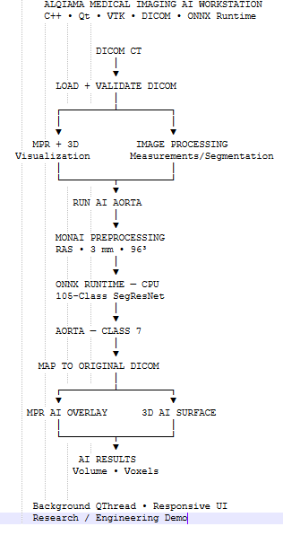

# AI Medical Imaging Workstation

Native C++ • Qt 6 • VTK • DICOM • ONNX Runtime • MONAI

## Overview

## Demo

[▶ Watch the 75-second demo](video/medical_imaging_ai_demo_1080p.mp4)

## Architecture

## Core Capabilities

## AI Pipeline

## Engineering Highlights

## Reference Result

## Technology Stack

## Screenshots

## Project Scope

## Disclaimer