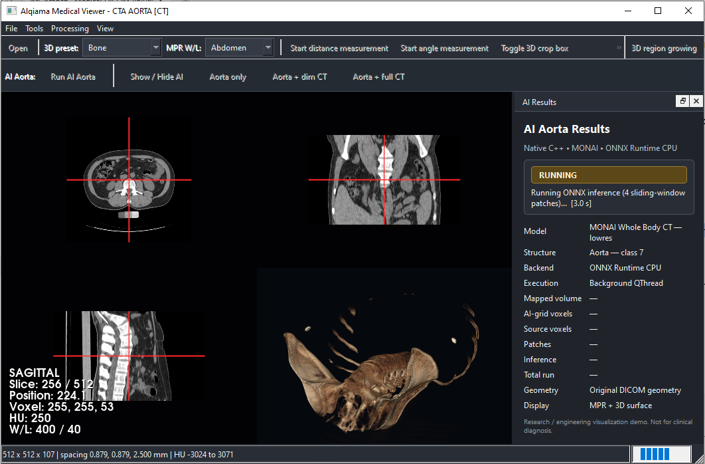
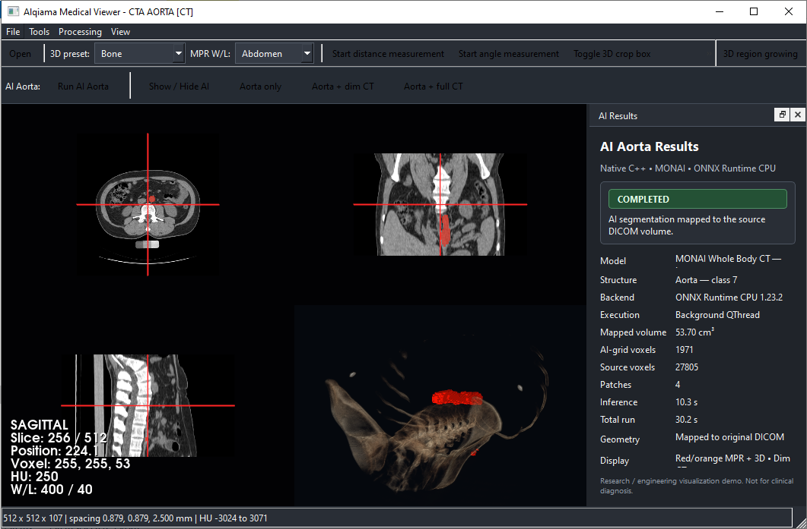

## Apple Vision Pro Medical XR

Immersive CT visualization prototype for Apple Vision Pro using
Metal, Swift, SwiftUI, visionOS, CompositorServices and ARKit.

### Highlights

- Custom Metal GPU CT volume ray marching
- Real 512 × 512 × 107 CT volume
- Bone, CTA, Soft Tissue and Lung presets
- Axial / Coronal / Sagittal orthogonal CT views
- Window / Level controls
- Rotate / Pan / Zoom interaction
- Spatial medical visualization workspace
- Developed on macOS with Xcode
- Validated in Apple Vision Pro visionOS 26 Simulator

### Technologies

Swift · SwiftUI · Metal · visionOS · CompositorServices · ARKit · MTLTexture3D

### Live Case Study

https://www.alqiamalabs.com/apple-vision-pro-medical-xr/

## Apple Vision Pro · Spatial Computing · Medical Visualization

**Apple Vision Pro** · **visionOS** · **Metal** · **Swift** · **SwiftUI** ·
**CompositorServices** · **ARKit** · **Spatial Computing** ·
**Medical Imaging** · **CT Volume Rendering** · **GPU Ray Marching** ·
**MTLTexture3D**

### Technology Stack

| Apple / XR | GPU Rendering | Medical Imaging |
|---|---|---|
| **Apple Vision Pro** | **Metal** | **Medical Imaging** |
| **visionOS** | **GPU Ray Marching** | **CT Volume Rendering** |
| **Swift** | **MTLTexture3D** | **HU Transfer Functions** |
| **SwiftUI** | **3D Texture Sampling** | **Orthogonal CT Views** |
| **CompositorServices** | **Gradient Lighting** | **Window / Level** |
| **ARKit** | **Volume Rendering** | **CT Visualization** |

# AI Medical Imaging Workstation

**Native C++ • DICOM • MPR • 3D Volume Rendering • ONNX Runtime • MONAI**

**DICOM → Medical Visualization → GPU Volume Rendering → Image Processing → AI Inference → MPR/3D AI Results**

## Overview

A native C++ medical imaging workstation combining DICOM CT visualization, image processing, quantitative analysis, and AI-assisted segmentation in a single interactive desktop application.

The application provides synchronized MPR and 3D volume visualization, runs a MONAI whole-body CT segmentation model through ONNX Runtime, and maps AI predictions back to the original DICOM geometry for MPR overlays and interactive 3D visualization.

## Demo

[▶ Watch the 75-second demo](video/medical_imaging_ai_demo_1080p.mp4)

## Architecture

## Core Capabilities
- DICOM CT loading and geometry validation
- Axial / Coronal / Sagittal MPR
- GPU 3D volume rendering
- Measurements, cropping and segmentation
- Native ONNX AI inference

## AI Pipeline
DICOM CT → MONAI-compatible preprocessing → 96³ sliding-window inference
→ ONNX Runtime → Aorta extraction → Original DICOM geometry mapping

## Engineering Highlights

- Native **C++17** implementation with Qt 6 and VTK
- GPU-accelerated **3D CT volume rendering** using VTK / OpenGL
- MONAI-compatible preprocessing reproduced in C++
- **96³ sliding-window inference** with Gaussian blending
- **105-class** segmentation through ONNX Runtime
- AI predictions mapped back to the **original DICOM geometry**
- Background **QThread** execution keeps the viewer responsive
- Segmentation visualized as synchronized **MPR overlays + interactive 3D surface**

## Reference Result

Validated reference case:

- Target structure: **Aorta — Class 7**
- Output classes: **105**
- Sliding-window patches: **4**
- AI-grid voxels: **1,971**
- Source-grid voxels: **27,805**
- Aorta volume: **53.70 cm³**
- ONNX inference time: **~10 s**
- End-to-end AI pipeline: **~30 s**
- Backend: **ONNX Runtime CPU**
- Execution: **Background QThread**

## Technology Stack
C++17 • Qt 6 • VTK 9.3 • vtk-dicom • ONNX Runtime • MONAI • CMake

Component	Technology
Language	C++17
Desktop UI	Qt 6
Medical Visualization	VTK 9.3
DICOM	vtk-dicom
AI Runtime	ONNX Runtime
AI Framework / Model	MONAI
3D Rendering	VTK / OpenGL
Build System	CMake
Development Environment	Visual Studio 2022
Platform	Windows
AI Execution	CPU
Background Processing	QThread

## Screenshots

### AI Running

### AI Completed

### Aorta + Dim CT

### MPR AI Overlay

## Project Scope
Public engineering and portfolio showcase. Full proprietary application source is not included.

## Data Attribution

The CT/DICOM data used in this demonstration is the HEART_CT
sample dataset distributed with the Fovia F.A.S.T. Web/Cloud SDK
demo cases.

The dataset is used only for software engineering and visualization
demonstration purposes.

Alqiama Technologies does not claim ownership of the imaging data.
Original DICOM files are not included or redistributed in this repository.

Source: Fovia F.A.S.T. Web/Cloud SDK demo cases — HEART_CT]

## Disclaimer
Research / engineering visualization demo. Not intended for clinical diagnosis or patient care.